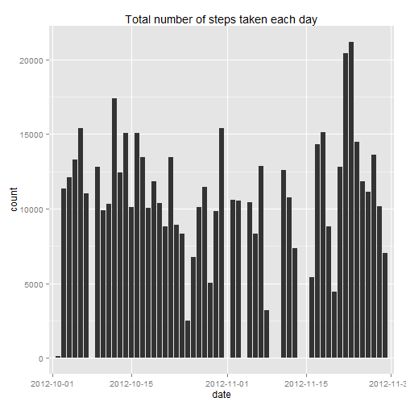
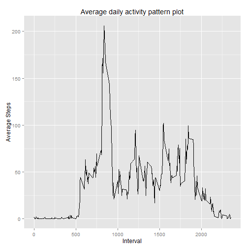
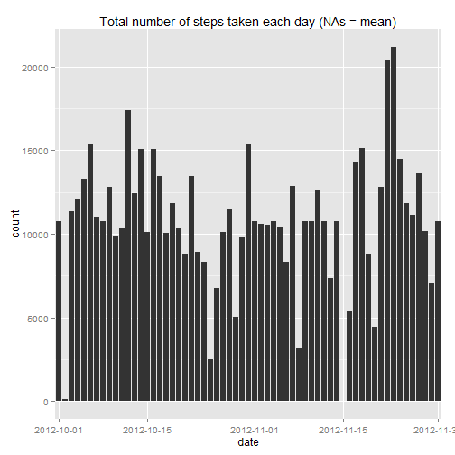
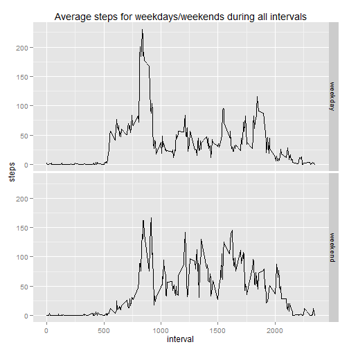

# Reproducible Research: Peer Assessment 1
### by Adriana Rivera


## Loading and preprocessing the data

```r
myActivity <- read.csv("activity.csv")
```


## What is mean total number of steps taken per day?
#### First we want to see the total number of steps taken each day during 2 months

```r
require(ggplot2)
```

```
## Loading required package: ggplot2
```


```r
qplot(date, data = myActivity, weight = steps, geom = "histogram", main = "Total number of steps taken each day") + 
    scale_x_discrete(breaks = c("2012-10-01", "2012-10-15", "2012-11-01", "2012-11-15", 
        "2012-11-30"))
```

 


#### Now we calculate the mean and median of steps taken per day

```r
mySums <- by(myActivity[, 1], myActivity$date, sum)  #Vector with the total number of steps per day.
mean(mySums, na.rm = TRUE)
```

```
## [1] 10766
```

```r
median(mySums, na.rm = TRUE)
```

```
## [1] 10765
```


## This is the average daily activity pattern plot.

```r
myIntervalMean <- aggregate(myActivity$steps, list(interval = myActivity$interval), 
    mean, na.rm = TRUE)  #this are the total number of steps per day.
qplot(myIntervalMean$interval, myIntervalMean$x, geom = "line", xlab = "Interval", 
    ylab = "Average Steps", main = "Average daily activity pattern plot")
```

 


#### The 5-minute interval with the maximun number of steps, on average across all the days in the dataset.

```r
myIntervalMean[which.max(myIntervalMean$x), 1]
```

```
## [1] 835
```


## Inputing missing values
### 1. Total number of missing values in the dataset (total number of rows with NAs)

```r
summData <- summary(myActivity)
print(summData)
```

```
##      steps               date          interval   
##  Min.   :  0.0   2012-10-01:  288   Min.   :   0  
##  1st Qu.:  0.0   2012-10-02:  288   1st Qu.: 589  
##  Median :  0.0   2012-10-03:  288   Median :1178  
##  Mean   : 37.4   2012-10-04:  288   Mean   :1178  
##  3rd Qu.: 12.0   2012-10-05:  288   3rd Qu.:1766  
##  Max.   :806.0   2012-10-06:  288   Max.   :2355  
##  NA's   :2304    (Other)   :15840
```

```r
myNA <- summData[7, 1]
```

#### NAs were found only in the steps field, and the total number of rows with ** NA's   :2304   **

### 2 & 3. For filling in all of the missing values in the dataset, I chose the strategy of substituting NAs with the **mean** for each 5-minute interval, which will be added to a copy of the original data set.


```r
myFilledActivity <- merge(myActivity, myIntervalMean, by.x = "interval", by.y = "interval", 
    sort = FALSE)  #Added extra col with means of respective time interval.
rowsNA <- is.na(myFilledActivity$steps)
myFilledActivity$steps[rowsNA] <- myFilledActivity$x[rowsNA]  # New set is correctly filled. I only have the extra column x, which will be unused
```


### 4. Histogram of the total number of steps taken each day
#### Do these values differ from the estimates from the first part of the assignment? What is the impact of inputing missing data on the estimates of the total daily number of steps? 
##### **ANSWER:** The distribution changed very little, and the estimates and graph are very similar to the original, it is more full but the pattern feels the same.


```r
qplot(date, data = myFilledActivity, weight = steps, geom = "histogram", main = "Total number of steps taken each day (NAs = mean)") + 
    scale_x_discrete(breaks = c("2012-10-01", "2012-10-15", "2012-11-01", "2012-11-15", 
        "2012-11-30"))
```

 

#### Now we calculate the mean and median of steps taken per day when including "NA = mean"."

```r
myFilledSums <- by(myFilledActivity[, 2], myFilledActivity$date, sum)  #this are the total number of steps per day.
mean(myFilledSums, na.rm = TRUE)
```

```
## [1] 10766
```

```r
median(myFilledSums, na.rm = TRUE)
```

```
## [1] 10766
```


### Are there differences in activity patterns between weekdays and weekends?
#### **ANSWER:** As we can see in the next plot, the person walks more when is time to go to work, and not as much the rest of the days. On the weekends that person walks more uniform during waking hours.

```r
myWeekends = weekdays(as.Date(myFilledActivity$date)) == "Sunday" | weekdays(as.Date(myFilledActivity$date)) == 
    "Saturday"
myFilledActivity$x[myWeekends] <- "weekend"
myFilledActivity$x[!myWeekends] <- "weekday"
myFilledActivity$x <- as.factor(myFilledActivity$x)

ggplot(myFilledActivity, aes(interval, steps)) + facet_grid(x ~ .) + stat_summary(fun.y = mean, 
    geom = "line") + ggtitle("Average steps for weekdays/weekends during all intervals")
```

 

